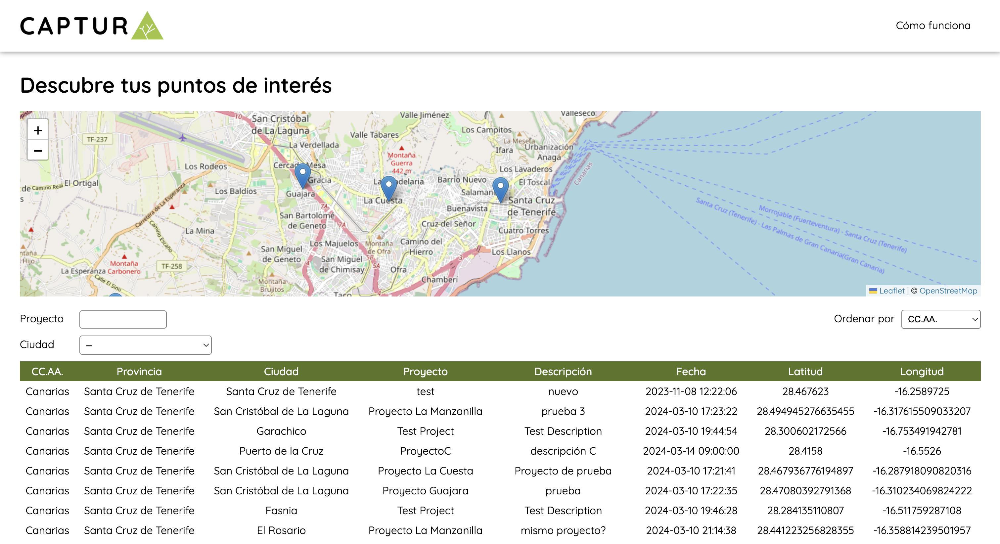
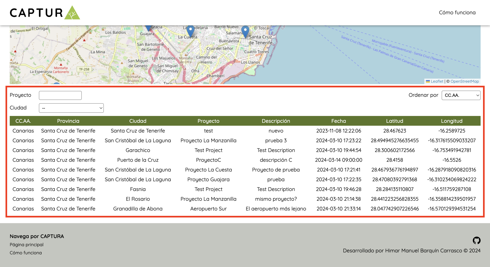
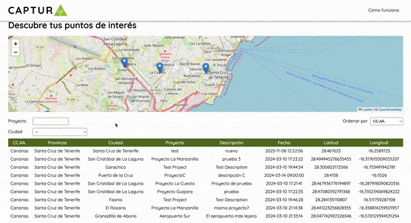
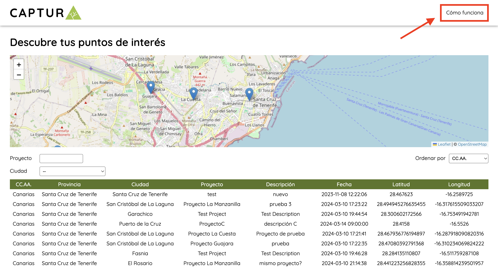

# PROYECTO CAPTURA

Proyecto realizado para la presentación de una prueba técnica.

## Introducción

CAPTURA es una aplicación web que permite la **creación y consulta de marcadores personalizados** en un mapa.



En ella, **puedes observar todos los marcadores existentes**, tanto desde el propio mapa como con la tabla que se puede encontrar debajo. En dicha tabla, **puedes filtrar por nombre de proyecto y/o ciudad, además de ordenar por la columna que desees**.



Además, puedes **localizar un marcador en el mapa a través de la tabla**, simplemente haciendo click en la fila de la tabla correspondiente al marcador que estás buscando.



**Puedes consultar nuestra guía de uso** en la sección "Cómo funciona" de la propia página.



## Instalación

Para instalar el proyecto en local, debe primero descargar el proyecto:

```bash
git clone https://github.com/XavYan/CAPTURA-prueba-tecnica.git
```

Nos movemos hacia la carpeta raíz del proyecto:

```bash
cd CAPTURA-prueba-tecnica
```

A continuación, y estando dentro de la carpeta raíz del proyecto, instalamos las dependencias necesarias:

```bash
npm install
```

Finalmente, podemos ejecutar la versión local con:

```bash
npm start
```

Si todo ha ido bien, veremos la aplicación funcionando en la ruta `http://localhost:4200`.

## Despliegue del proyecto

Una vez instalado en local, si queremos compilar el proyecto para desplegarlo en producción, podemos hacer:

```bash
npm run build
```

Si lo hemos hecho bien, encontraremos en la carpeta raíz del proyecto la carpeta `dist`. Dentro de `dist`, la carpeta `browser` que contiene es la que podemos distribuir para realizar el despliegue.

La estructura que nos deberíamos encontrar en la carpeta `dist` debería ser similar a la siguiente:

```bash
dist
└── captura
    ├── 3rdpartylicenses.txt
    └── browser
        ├── assets
        │   ├── CAPTURA-LOGO-510px-141px.png
        │   ├── captura-mobile.png
        │   ├── github.png
        │   ├── how-to-use-gif-2.webp
        │   ├── how-to-use-gif-3.gif
        │   ├── how-to-use-gif-4.gif
        │   └── how-to-use-photo1.png
        ├── favicon.ico
        ├── index.html
        ├── main-N2HXI5D3.js
        ├── polyfills-RT5I6R6G.js
        └── styles-BAFCYYP7.css
```

## Dependencias

Este proyecto está realizado con [Angular CLI](https://github.com/angular/angular-cli) version 17.2.3.

Además, utiliza la librería [LeafLet](https://leafletjs.com/) versión 1.9.4 para la gestión del mapa, con la contribución de [OpenStreetMap](https://www.openstreetmap.org/copyright).

El resto del desarrollo se ha realizado puramente con HTML y CSS, separando las estructuras más importantes en componentes. Por lo que **no tiene más depedencias**.

## Contribuciones

Este proyecto ha sido realizado por &copy; Himar Manuel Barquín Carrasco en fecha 10 de marzo de 2024, con el objetivo de presentar una prueba técnica para el proceso de selección de Desarrollador FullStack.
